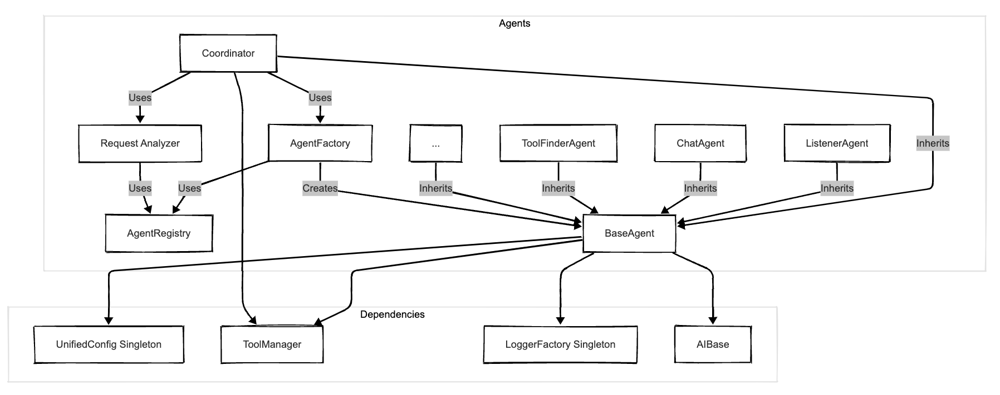

# Agent System

## Overview

The Agentic AI framework utilizes a flexible agent system centered around a `Coordinator` agent. This system is designed to analyze incoming user requests, determine the appropriate course of action, and delegate tasks to specialized agents. All agents inherit common functionality from a `BaseAgent` class and are managed through an `AgentRegistry` and instantiated by an `AgentFactory`.

## Core Components

- **`BaseAgent` (`src/agents/base_agent.py`)**:

  - The foundation for all agents in the system.
  - Provides common initialization logic, including loading agent-specific configuration from `agents.yml` via `UnifiedConfig`.
  - Handles basic request processing, including applying model and system prompt overrides specified in the request.
  - Includes a default `can_handle()` method (returning low confidence) that specialized agents should override.
  - Provides basic response enrichment with agent ID and status.

- **`Coordinator` (`src/agents/coordinator.py`)**:

  - The central orchestrator of the agent system.
  - Acts as the primary entry point for user requests directed at the agent layer.
  - Uses `RequestAnalyzer` to classify the intent of the incoming request (e.g., META, IMAGE_GENERATION, AUDIO_TRANSCRIPTION, QUESTION, TASK).
  - Routes requests based on the classified intent:
    - **META**: Handles directly by providing system information (agents, tools).
    - **IMAGE_GENERATION**: Handles directly by calling the `generate_image` tool via `ToolManager`.
    - **AUDIO_TRANSCRIPTION**: Delegates to a specialized agent (e.g., `ListenerAgent`).
    - **QUESTION**: Delegates simple queries to a configured default agent (e.g., `ChatAgent`).
    - **TASK**: Intended for complex requests potentially requiring multiple agents. The current implementation might delegate to a default handler or requires further development for multi-step/multi-agent planning and execution.
    - **UNKNOWN**: Falls back to the default handler agent.
  - Utilizes `AgentFactory` to create instances of agents for delegation.
  - May use `ResponseAggregator` (though TASK handling is currently simplified) to combine results from multiple agents if implemented.
  - Checks delegated agent response metadata for `tool_history` and uses `FrameworkMessageFormatter` to present tool results/errors clearly.

- **`AgentFactory` (`src/agents/agent_factory.py`)**:

  - Responsible for creating instances of specific agent types.
  - Uses `AgentRegistry` to know which agent classes correspond to agent IDs.
  - Injects necessary dependencies like `UnifiedConfig`, `ToolManager`, and loggers into the created agent instances.

- **`AgentRegistry` (`src/agents/agent_registry.py`)**:

  - Maintains a mapping between agent IDs (strings used in configuration and code) and their corresponding agent classes.
  - Allows for dynamic registration and discovery of available agents.
  - Used by `AgentFactory` to find the correct class to instantiate.
  - _Note: `agent_registrar.py` might contain related or older registration logic._

- **`RequestAnalyzer` (`src/agents/request_analyzer.py`)**:

  - Analyzes incoming requests primarily using keyword/regex matching to determine user intent (META, IMAGE_GENERATION, AUDIO_TRANSCRIPTION, QUESTION, TASK, UNKNOWN).
  - Does **not** currently use an LLM for this classification.
  - Its classification directly informs the `Coordinator`'s routing decisions, including whether to handle directly (META, IMAGE_GENERATION) or delegate.

- **`ResponseAggregator` (`src/agents/response_aggregator.py`)**:
  - Designed to combine responses from multiple agents (primarily for complex TASK requests).
  - Takes the original request and a list of individual agent responses.
  - Synthesizes a final, coherent response for the user.
  - Its usage might be limited depending on the current implementation status of multi-agent TASK handling in the `Coordinator`.

## Specialized Agents

These agents inherit from `BaseAgent` and perform specific functions:

- **`ListenerAgent` (`src/agents/listener_agent.py`)**:

  - Handles audio input, likely performing transcription using a specified speech-to-text model or service.
  - Triggered by the `Coordinator` for requests identified as `AUDIO_TRANSCRIPTION`.

- **`ChatAgent` (`src/agents/chat_agent.py`)**:

  - A general-purpose agent for handling conversational queries or simple questions.
  - Often configured as the default handler in the `Coordinator` for `QUESTION` intent or fallbacks.

- **`CodingAssistantAgent` (`src/agents/coding_assistant_agent.py`)**:

  - Specialized for code-related tasks (generation, explanation, debugging).
  - Likely uses specific system prompts or configurations defined in `agents.yml`.

- **`ToolFinderAgent` (`src/agents/tool_finder_agent.py`)**:

  - Responsible for identifying the most relevant tools from the `ToolManager` to fulfill a user's request.
  - May involve an LLM call analyzing the request against the descriptions of available tools.

- **Other Potential Agents**: The system may include other specialized agents not explicitly listed here (check `src/agents` and `src/config/agents.yml`).

## Request Flow (Simplified)

1.  User request (potentially initiated via UI or API) reaches the agent system.
2.  The `Coordinator` receives the request.
3.  `Coordinator` uses `RequestAnalyzer` to classify intent.
4.  **If META**: `Coordinator` gathers info and responds directly.
5.  **If AUDIO**: `Coordinator` uses `AgentFactory` to get `ListenerAgent`, delegates, and returns the response.
6.  **If QUESTION/UNKNOWN**: `Coordinator` uses `AgentFactory` to get the default agent (e.g., `ChatAgent`), delegates, and returns the response.
7.  **If TASK**: `Coordinator` (currently) might delegate to the default handler or execute more complex logic (potentially involving `ToolFinderAgent`, other specialized agents, and `ResponseAggregator` - requires verification of current implementation).
8.  The chosen agent(s) process the request, potentially using their injected `AIBase` instance (LLM) and `ToolManager`.
9.  The final response (potentially aggregated) is returned.

## Architecture Diagram Prompt

_(Note: This diagram represents the logical flow and dependencies based on the code review. Dashed lines indicate inheritance or potential usage.)_
