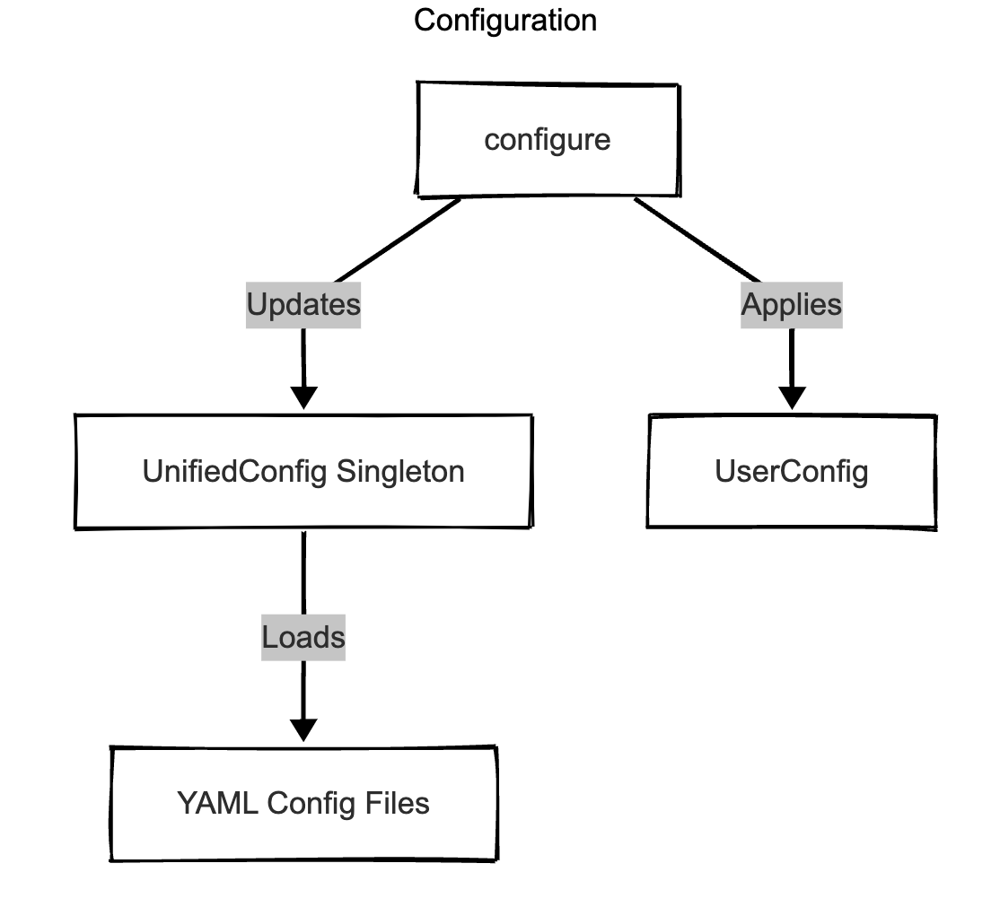
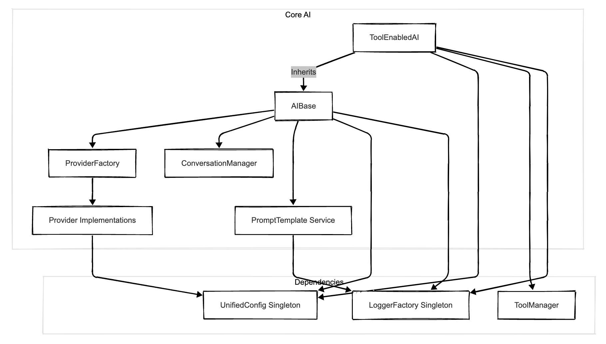
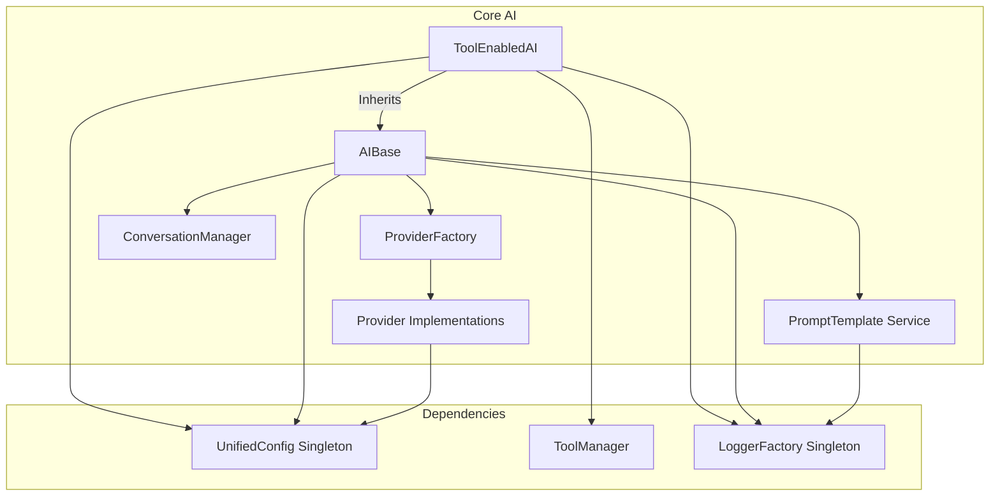
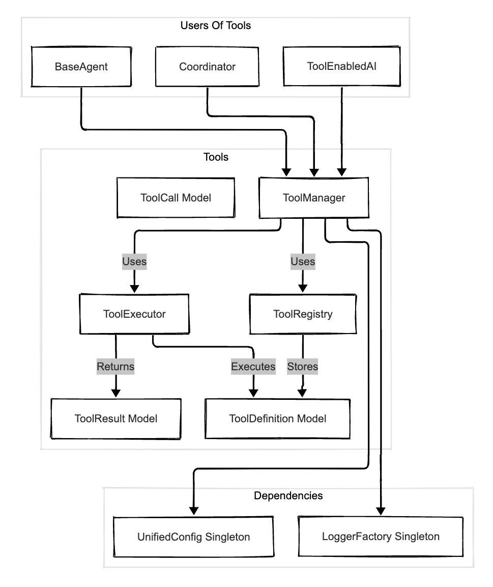
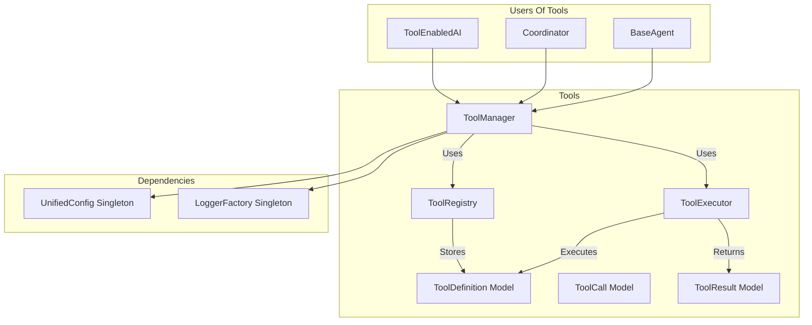
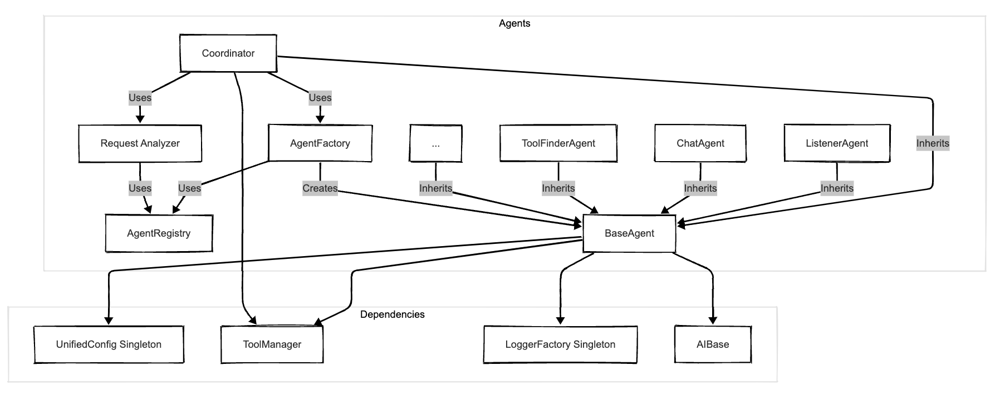
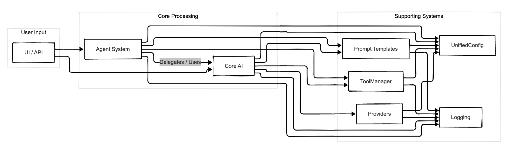

# Agentic-AI Architecture

This document describes the architecture of the Agentic-AI framework, focusing on the core design principles and component relationships.

## Overview

Agentic-AI is a modular framework for building AI applications with integrated tool usage and agent-based processing capabilities. The architecture emphasizes:

- **Separation of Concerns**: Each component has a clear, focused responsibility (e.g., configuration, core AI logic, tool execution, agent coordination).
- **Interface-Based Design**: Components interact through well-defined interfaces (`AIInterface`, `ProviderInterface`, `AgentInterface`, etc.) where applicable.
- **Configuration Management**: A centralized `UnifiedConfig` system loads settings from modular YAML files, allowing overrides via code, files, or environment variables.
- **Dependency Injection/Access**: Key services like configuration (`UnifiedConfig`), logging (`LoggerFactory`), and potentially `ToolManager` or `PromptTemplate` are often accessed via singletons or passed during initialization.
- **Standardized Error Handling**: A hierarchy of exceptions (`AIFrameworkError`, `AIConfigError`, `AIProviderError`, etc.) and an `ErrorHandler` facilitate consistent error management.

## Core Components

- **Configuration (`src/config`)**: Manages all settings.

  - `UnifiedConfig`: Singleton providing access to merged configuration from YAML files (`models.yml`, `providers.yml`, `agents.yml`, `tools.yml`, `use_cases.yml`) and overrides.
  - `UserConfig`: Represents user-provided overrides.
  - `configure()`: Function to apply user overrides.

- **Core AI (`src/core`)**: Handles direct interaction with LLMs.

  - `AIBase`: Foundational class managing provider selection (via `ProviderFactory`), basic request/response handling, and conversation history (`ConversationManager`).
  - `ToolEnabledAI`: Extends `AIBase` to manage the tool-calling loop, interacting with `ToolManager` and the provider.
  - `ProviderFactory`: Creates instances of specific provider clients.
  - `providers/`: Contains implementations for different AI providers (OpenAI, Anthropic, etc.), inheriting from `BaseProvider` and implementing `ProviderInterface`.
  - `ConversationManager`: Tracks message history for AI interactions.

- **Tools (`src/tools`)**: Manages function/API calling capabilities.

  - `ToolManager`: Central service for registering tools (via `ToolRegistry`) and executing them (via `ToolExecutor`).
  - `ToolRegistry`: Stores `ToolDefinition` objects and handles provider-specific formatting.
  - `ToolExecutor`: Executes the actual tool functions.
  - `models`: Defines `ToolDefinition`, `ToolCall`, `ToolResult`.

- **Agents (`src/agents`)**: Enables specialized processing and workflows.

  - `Coordinator`: Central agent orchestrating request handling based on intent analysis (`RequestAnalyzer`), often delegating to specialized agents.
  - `BaseAgent`: Abstract base class for all agents.
  - `AgentFactory`: Creates agent instances using `AgentRegistry`.
  - `AgentRegistry`: Maps agent IDs to agent classes.
  - Specialized Agents (e.g., `ListenerAgent`, `ChatAgent`, `ToolFinderAgent`): Implement specific functionalities.

- **Prompts (`src/prompts`)**: Manages reusable prompt templates.

  - `PromptTemplate`: Service loading templates from YAML files, handling versioning and variable substitution.

- **Utilities (`src/utils`)**: Provides common functionalities.

  - `LoggerFactory`: Creates configured logger instances.

- **Error Handling (`src/exceptions.py`)**: Defines custom exceptions and the `ErrorHandler`.

- **UI (`src/ui`)**: Provides user interfaces.
  - `SimpleChatUI`: A Gradio-based chat interface interacting with the `Coordinator`.

## Component Relationships Diagrams

These diagrams illustrate the key relationships and dependencies between the major components.

### 1. Configuration System



```mermaid
graph TD
    subgraph Configuration
        UnifiedConfig[UnifiedConfig Singleton]
        YAMLFiles[YAML Config Files]
        ConfigureFunc[configure()]
        UserConfig[UserConfig]
        UnifiedConfig -- Loads --> YAMLFiles
        ConfigureFunc -- Applies --> UserConfig
        ConfigureFunc -- Updates --> UnifiedConfig
    end

    subgraph Components Using Config
        AIBase
        ToolEnabledAI
        Coordinator
        ToolManager
        ProviderImplementations
        BaseAgent
    end

    AIBase --> UnifiedConfig
    ToolEnabledAI --> UnifiedConfig
    Coordinator --> UnifiedConfig
    ToolManager --> UnifiedConfig
    ProviderImplementations --> UnifiedConfig
    BaseAgent --> UnifiedConfig
```

### 2. Core AI System





### 3. Tool Subsystem





### 4. Agent System



```mermaid
graph TD
    subgraph Agents
        Coordinator[Coordinator]
        AgentFactory[AgentFactory]
        AgentRegistry[AgentRegistry]
        BaseAgent[BaseAgent]
        ListenerAgent[ListenerAgent]
        ChatAgent[ChatAgent]
        ToolFinderAgent[ToolFinderAgent]
        OtherAgents[...]
        RequestAnalyzer[Request Analyzer]

        Coordinator -- Inherits --> BaseAgent
        ListenerAgent -- Inherits --> BaseAgent
        ChatAgent -- Inherits --> BaseAgent
        ToolFinderAgent -- Inherits --> BaseAgent
        OtherAgents -- Inherits --> BaseAgent

        Coordinator -- Uses --> AgentFactory
        Coordinator -- Uses --> RequestAnalyzer
        AgentFactory -- Uses --> AgentRegistry
        AgentFactory -- Creates --> BaseAgent
        RequestAnalyzer -- Uses --> AgentRegistry
    end

    subgraph Dependencies
       UnifiedConfig[UnifiedConfig Singleton]
       ToolManager[ToolManager]
       LoggerFactory[LoggerFactory Singleton]
       AIBase[AIBase]
    end

    BaseAgent --> UnifiedConfig
    BaseAgent --> ToolManager
    BaseAgent --> LoggerFactory
    BaseAgent --> AIBase
    Coordinator --> ToolManager # Coordinator might directly use TM or via BaseAgent
```

### 5. High-Level Interactions



```mermaid
graph LR
    subgraph User Input
        UI[UI / API]
    end

    subgraph Core Processing
        Coordinator[Agent System (Coordinator)]
        ToolEnabledAI[Core AI (ToolEnabledAI)]
    end

    subgraph Supporting Systems
        Config[Configuration (UnifiedConfig)]
        Tools[Tool Subsystem (ToolManager)]
        Prompts[Prompt Templates]
        Logging[Logging]
        Providers[Providers]
    end

    UI --> Coordinator
    UI --> ToolEnabledAI # Direct AI calls possible

    Coordinator -- Delegates / Uses --> ToolEnabledAI
    Coordinator --> Tools
    ToolEnabledAI --> Tools
    ToolEnabledAI --> Providers

    Coordinator --> Config
    ToolEnabledAI --> Config
    Tools --> Config
    Providers --> Config
    Prompts --> Config

    Coordinator --> Prompts
    ToolEnabledAI --> Prompts

    Coordinator --> Logging
    ToolEnabledAI --> Logging
    Tools --> Logging
    Providers --> Logging
    Prompts --> Logging
```

_(Note: These diagrams illustrate major dependencies and interactions. Not all minor connections are shown for clarity.)_

## Key Architectural Improvements

- **Unified Configuration**: Replaced disparate config managers with a single `UnifiedConfig` singleton accessing modular YAML files, simplifying configuration access.
- **Standardized Provider Interface**: `BaseProvider` and `ProviderInterface` enforce a standard structure for provider implementations, returning a standardized `ProviderResponse` object to simplify core AI logic.
- **Refined Agent System**: Centralized orchestration logic in the `Coordinator` agent, supported by `AgentFactory`, `AgentRegistry`, and `RequestAnalyzer`, providing a clearer structure than earlier multi-agent concepts.
- **Focused Tool Subsystem**: `ToolManager`, `ToolRegistry`, and `ToolExecutor` provide clear responsibilities for tool definition, formatting, and execution, integrated seamlessly with `ToolEnabledAI`.
- **Simplified Core AI**: `AIBase` handles fundamental LLM interaction, while `ToolEnabledAI` specifically layers tool-calling orchestration on top.
- **YAML-based Prompt Templates**: Standardized on the `PromptTemplate` service loading versioned templates from YAML files as the primary prompt management method.
- **Consistent Error Handling**: Implemented a clear exception hierarchy and `ErrorHandler` for uniform error management.

## Usage Example

```python
from src.core import ToolEnabledAI
from src.agents import Coordinator
from src.config import configure, UseCasePreset
from src.tools import ToolDefinition, ToolManager # Assuming definition exists

# --- Configuration (Optional) ---
# Configure framework settings if defaults aren't suitable
# configure(model="gpt-4o", use_case=UseCasePreset.CODING)

# --- Direct AI Usage with Tools ---
print("\n--- Using ToolEnabledAI Directly ---")
# Create a ToolEnabledAI instance (uses configured model)
ai = ToolEnabledAI()

# Tools are typically loaded via configuration (tools.yml)
# If manual registration is needed (less common):
# tool_manager = ToolManager() # Get or create manager
# weather_tool_def = ToolDefinition(...) # Define get_weather
# tool_manager.register_tool("get_weather", weather_tool_def)
# ai = ToolEnabledAI(tool_manager=tool_manager)

# Make a request - process_prompt handles the tool loop
response_ai = ai.process_prompt("What is the weather like in London?")
print(f"AI Response: {response_ai}")

# --- Agent-Based Usage via Coordinator ---
print("\n--- Using Coordinator Agent ---")
# Create a Coordinator instance (uses default dependencies & config)
coordinator = Coordinator()

# Prepare a request for the coordinator
request_data = {
    "prompt": "Summarize the main points of the latest Agentic AI documentation updates.",
    # Add other relevant info like user_id, session_id if needed by agents
}

# Process the request through the coordinator
response_coord = coordinator.process_request(request_data)

# Print the final content from the coordinator's response
print(f"Coordinator Response: {response_coord.get('content')}")
```
